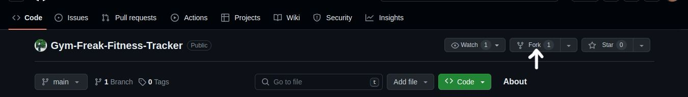
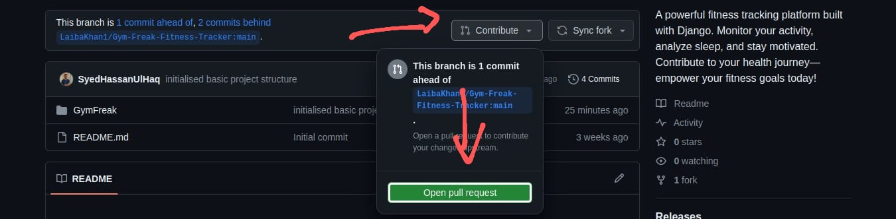
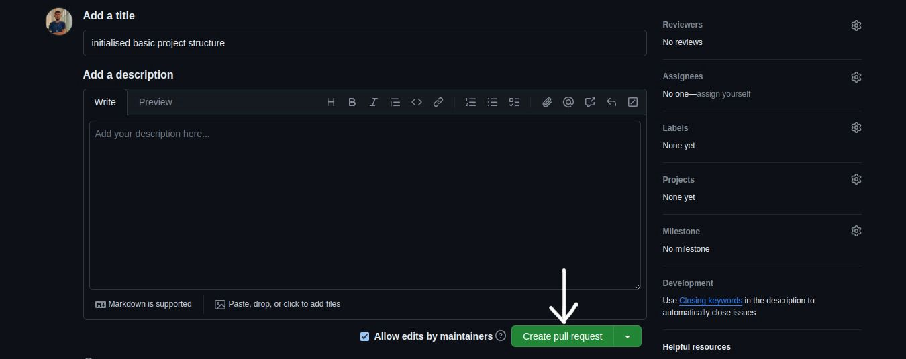

# Gym-Freak Fitness Tracker Project

Welcome to the Fitness Tracker project! We're excited to have you contribute.

## Getting Started

To contribute to this project, follow these steps:

### 1. Fork the Repository

Click on the "Fork" button at the top-right of this repository page to create a copy of the project in your GitHub account.



### 2. Clone the Repository

Clone your forked repository to your local machine using the following command in your terminal:

```bash
git clone https://github.com/your-username/fitness-tracker.git
```
### 3. Run the Django Development Server

Navigate to the project directory and start the Django development server:

```bash
cd Gym-Freak-Fitness-Tracker
```
```bash
python3 GymFreak/manage.py runserver
```

please note that if you're using django for the first time then first install all the required project dependencies before running the server by using the following command in your terminal:

```bash
pip install -r requirements.txt
```
### 4. Make Changes

Make the necessary changes to the codebase on your local machine.

### 5. Commit Changes

Stage and commit your changes using the following commands:

```bash
git add .
```
```bash
git commit -m ""
```
### 6. Push Changes

Push your changes to your GitHub repository:

```bash
git push
```
### 7. Open a Pull Request

1. Visit your forked repository on GitHub.
2. Click on the "New Pull Request" button.
   
3. Ensure that the base repository is set to the original repository and the base branch is main.
4. Ensure that the head repository is set to your repository and the compare branch is the branch where you made your changes.
5. Click on "Create Pull Request."
   
   

## LICENSE
This project is licensed under the [MIT License](LICENSE) - see the LICENSE file for details.

Thank you for contributing to the Fitness Tracker project! 🏋️‍♂️

